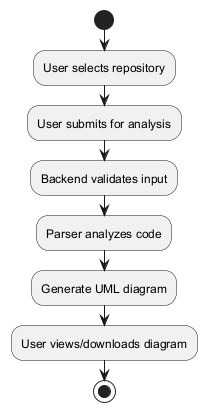

# Project-Based Learning (PBL) Report  
**Title:** UML Designer AI  
**Course:** Bachelor of Technology in Computer Science and Engineering (Course Code: [Placeholder])  
**Student Name:** [Student Name]  
**Roll Number:** [Roll Number]  
**Faculty Guide:** [Guide Name]  
**Department:** Department of Computer Science and Engineering, Geethanjali College of Engineering and Technology  
**Academic Year:** A.Y. 2025–26  

---

## Abstract

This project presents UML Designer AI, a full-stack system that automates the extraction, analysis, and visualization of software structure as UML diagrams. The system brings together static code analysis, heuristic relationship detection, and optional AI-assisted inference to produce normalized schemas suitable for diagram generation and documentation. 

The backend provides a secure, performant API gateway with a layered caching strategy to support repeated analyses, while a dedicated Python microservice handles multi-language parsing and relationship inference. The frontend renders diagrams using PlantUML and supports export and interaction. Throughout the implementation, we focused on key engineering trade-offs: balancing accuracy with performance, maintaining modularity for multi-language support, and ensuring robust validation to safely handle untrusted repository inputs. 

This report documents our design choices, implementation details, representative code snippets, and evaluation considerations. It serves as a comprehensive PBL submission demonstrating system-level thinking, practical engineering skills, and tested code artifacts.

## Table of Contents

1. Abstract
2. Introduction
3. System Design
  3.1 System Architecture
  3.2 Modules
  3.3 Backend Design
  3.4 Diagrams
4. Implementation
  4.1 Module Integration
  4.2 Key Code Snippets
  4.3 Expanded Code Examples
5. Conclusion
6. References

---

## 1. Introduction

UML Designer AI is an open-source, full-stack platform designed to automate the generation, analysis, and visualization of Unified Modeling Language (UML) diagrams from source code or natural language prompts. The project addresses a real-world need for rapid, accurate software architecture visualization, helping bridge communication gaps between technical and non-technical stakeholders.

The motivation for this project comes from the complexity of modern software systems and the necessity for clear documentation and design communication. The system enables users—whether they're developers, students, or analysts—to convert codebases or requirements into professional UML diagrams, supporting better collaboration and understanding.

Our learning objectives included mastering full-stack development, API design, code analysis, and applying software engineering principles such as modularity, security, and testing. The technology stack includes Node.js (Express.js), Python (Flask), React (Next.js), Tailwind CSS, PlantUML, and AI/LLM integration for enhanced code analysis.

Throughout development, we emphasized understanding why certain engineering choices were made. The key trade-offs included:

- **Accuracy vs. performance:** Deep static analysis yields richer diagrams but is slower. The system caches results and offers configurable timeouts to balance responsiveness.
- **Modularity:** Language-specific analyzers are implemented as pluggable modules, allowing new languages to be added without changing the core pipeline.
- **Security:** Untrusted repository inputs are treated as potentially adversarial. Uploads are validated, and the backend enforces size/time limits and CORS constraints.

The target audiences for this project include students learning software architecture, engineers who need quick visualizations of unfamiliar codebases, and educators who want reproducible diagram generation for assignments.

---

## 2. System Design

### System Architecture

UML Designer AI follows a modular, client-server architecture with three main components:

- **Frontend:** A React-based web application handles user interaction, diagram rendering, and export functionality.
- **Backend:** A Node.js Express API gateway manages requests, caching, security, and proxying to the parser.
- **Python Parser Microservice:** Analyzes code repositories, infers relationships, and generates normalized schemas for UML diagrams.

The flow of control follows a clear path:  
User → Frontend → Backend → Python Parser → Backend → Frontend → User

### Modules

The system is organized into three primary modules:

**Frontend:**  
The user interface handles input (code or prompt), diagram visualization, and export. Key components include `HomePage`, `PlantUMLDiagram`, and `GlobalErrorBoundary`.

**Backend:**  
API routing (`api.js`) manages caching (memory/disk), security (CORS, validation), logging, and monitoring. The main endpoint is `/analyze` (POST for code/prompt analysis).

**Python Parser:**  
Language-specific analyzers (Python, Java, C#, etc.) handle relationship detection, AI enhancement, and schema normalization. Core modules include `analyze.py`, `analyzers/`, `relationship/`, and `plantuml/`.

### Backend Design

Rather than using a traditional database, the system relies on a disk-based cache for analysis results. The caching strategy employs an LRU (Least Recently Used) in-memory cache along with persistent disk cache, keyed by repository URL and commit hash. This approach provides fast access for repeated analyses while maintaining results across server restarts.

### Diagrams

Below are the primary UML diagrams generated for this project. These images are stored in the `diagrams/` folder and will render directly when viewing this file on GitHub.

**Class Diagram** (core classes and relationships):


**Use Case Diagram** (user interactions and features):


**Activity Diagram** (workflow):



**State Diagram** (system states):


**Sequence Diagram** (request flow):


**Component Diagram** (modules and connections):


**Communication Diagram** (component messaging):


**Deployment Diagram** (deployment topology):


---

## 3. Implementation

### Module Integration

The implementation brings together three main components:

**Frontend:**  
Built with Next.js and React, using Tailwind CSS for styling. The `PlantUMLDiagram.js` component renders diagrams using a PlantUML server, handles errors, and supports SVG/PNG export.

**Backend:**  
Express.js routes requests, applies rate limiting, validates input, and manages the cache. Security features include CORS, request size limits, and input sanitization. Logging and monitoring are handled via Winston and custom metrics.

**Python Parser:**  
Uses AST parsing for Python, `javalang` for Java, and regex for other languages. Relationship detection is managed by `RelationshipDetector`. Optional AI enhancement uses Groq/OpenAI-compatible APIs.

### Key Code Snippets

The following code snippets demonstrate the core functionality of each component:

**1. Python File Analysis (PythonAnalyzer):**
```python
def analyze_file(self, file_path: str, package_path: str = "") -> List[Dict]:
    classes = []
    with open(file_path, 'r', encoding='utf-8', errors='ignore') as f:
        source = f.read()
    tree = ast.parse(source)
    self._extract_imports(tree)
    for node in ast.walk(tree):
        if isinstance(node, ast.ClassDef):
            class_dict = self._analyze_class(node, package_path)
            if class_dict:
                classes.append(class_dict)
                self.add_class_name(class_dict['class'])
    return classes
```
This function extracts classes, fields, and methods from Python files using AST.

**2. Java File Analysis (JavaAnalyzer):**
```python
def analyze_file(self, file_path: str, package_path: str = "") -> List[Dict]:
    classes = []
    with open(file_path, 'r', encoding='utf-8', errors='ignore') as f:
        source = f.read()
    tree = javalang.parse.parse(source)
    for path_nodes, cls in tree.filter(javalang.tree.ClassDeclaration):
        class_dict = self._analyze_class(cls, tree, source, package_path)
        if class_dict:
            classes.append(class_dict)
            self.add_class_name(class_dict['class'])
    return classes
```
This uses `javalang` to parse Java files and extract class/interface details.

**3. Relationship Detection:**
```python
def validate_relationships(self) -> List[Dict]:
    valid_relationships = []
    for rel in self.relationships:
        if self._is_valid_relationship(rel):
            valid_relationships.append(rel)
    return valid_relationships
```
This validates and deduplicates relationships between classes.

**4. API Request Flow (Backend):**
```javascript
router.post('/analyze', asyncHandler(async (req, res) => {
  // Validate input, check cache, proxy to Python parser, return result
}));
```
This handles analysis requests, applying caching and security checks.

**5. Frontend Diagram Rendering (React):**
```javascript
export default function PlantUMLDiagram({ uml, format = 'svg', server }) {
  const encoded = plantumlEncoder.encode(uml);
  const src = `${server}/${format}/${encoded}`;
  return ;
}
```
This renders UML diagrams in the frontend using a PlantUML server.

**6. Caching Strategy (Backend):**
```javascript
// Cache key helper
const cacheKey = (url, commit) => (commit ? `${url}@${commit}` : url);

// In-memory cache (LRU by insertion order) and disk persistence
const memCache = new Map();
const keyHash = s => require('crypto').createHash('sha1').update(s).digest('hex');

// Read cached analysis from disk (TTL-based)
const readDisk = async key => {
  try {
    const file = require('path').join(diskDir, `${keyHash(key)}.json`);
    const stat = await require('fs/promises').stat(file);
    if (Date.now() - stat.mtimeMs > diskTtlMs) {
      await require('fs/promises').unlink(file).catch(() => {});
      return null;
    }
    return JSON.parse(await require('fs/promises').readFile(file, 'utf8'));
  } catch {
    return null;
  }
};

// Persist cache entry to disk (best-effort)
const writeDisk = async (key, data) => {
  try {
    const file = require('path').join(diskDir, `${keyHash(key)}.json`);
    await require('fs/promises').writeFile(file, JSON.stringify(data));
  } catch (e) {
    logger?.warn?.(`Disk cache write failed: ${e.message}`);
  }
};

// Ensure memory cache capacity (evict oldest entries when over limit)
const ensureCapacity = () => {
  while (memCache.size > maxEntries) {
    const first = memCache.keys().next().value;
    if (!first) break;
    memCache.delete(first);
  }
};

// Example lookup
if (memCache.has(cacheKey)) {
  return memCache.get(cacheKey);
}
```
This implements cache key generation and lookup for backend caching.

### Expanded Code Examples

The following examples provide more detailed insight into the system's core functionality:

**7. Backend: Repository Analysis Handler**

This code from `backend/routes/api.js` shows how the system handles repository analysis requests, including cache lookup, proxying to the Python parser, schema validation, and cache writes:

```javascript
// POST /analyze (body: { githubUrl } or upload field repoZip)
router.post('/analyze', upload.single('repoZip'), asyncHandler(async (req, res) => {
  const timeout = Number(process.env.ANALYZE_TIMEOUT_MS || 120_000);
  const { githubUrl } = req.body || {};

  if (githubUrl) {
    const v = validateGitHubUrl(githubUrl);
    if (!v.isValid) throw createValidationError(v.error);

    const k = cacheKey(v.url);
    const cached = memCache.get(k);
    if (cached && Date.now() - cached.ts < cacheTtlMs) {
      return res.status(200).json(cached.data);
    }

    const disk = await readDisk(k);
    if (disk) {
      memCache.set(k, { data: disk, ts: Date.now() });
      ensureCapacity();
      return res.status(200).json(disk);
    }

    try {
      const response = await http.post(`${pythonUrl}/analyze`, { githubUrl: v.url }, { timeout });
      const data = response?.data ?? {};

      // Patch: Inject default meta if missing
      if (data && data.schema && (!data.schema.meta || typeof data.schema.meta !== 'object')) {
        data.schema.meta = { classes_found: 0, files_scanned: 0, languages: [], system: 'UnknownSystem' };
      }

      // Validate schema structure
      const validation = validateUmlSchema(data);
      if (!validation.isValid) {
        logger.warn('Invalid schema received from Python parser', { errors: validation.errors, url: v.url });
        throw createValidationError(`Invalid schema structure: ${validation.errors.join(', ')}`);
      }

      // Cache and persist
      const urlKey = cacheKey(v.url);
      memCache.set(urlKey, { data, ts: Date.now() });
      ensureCapacity();
      writeDisk(urlKey, data).catch(() => {});

      return res.status(response.status || 200).json(data);
    } catch (err) {
      if (err?.code === 'ECONNABORTED' || err?.code === 'ETIMEDOUT') throw createTimeoutError('Repository analysis');
      if (err?.response) {
        const { status, data } = err.response;
        if (status >= 400 && status < 500) throw createValidationError(data?.error || `Analysis failed: ${status}`);
      }
      throw createExternalServiceError('Python parser', err);
    }
  }

  if (req.file) {
    // File upload handling (ZIP validation, proxy to parser, validate response)
    ...
  }

  throw createValidationError('No repository provided');
}));
```

**8. Backend: PlantUML Generation Proxy**

This code from `backend/routes/api.js` handles PlantUML generation requests with validation and outbound calls:

```javascript
// POST /generate-plantuml
router.post('/generate-plantuml', asyncHandler(async (req, res) => {
  const timeout = Number(process.env.GENERATE_TIMEOUT_MS || 4000);
  const { schema, diagram_type } = req.body || {};
  if (!schema) throw createValidationError('schema is required');
  if (!diagram_type) throw createValidationError('diagram_type is required');

  const validTypes = ['class','sequence','usecase','state','activity','component','communication','deployment'];
  if (!validTypes.includes(diagram_type)) throw createValidationError(`Invalid diagram_type: ${diagram_type}`);

  try {
    const response = await http.post(`${pythonUrl}/generate-plantuml`, { schema, diagram_type }, { timeout });
    return res.status(response.status || 200).json(response.data ?? {});
  } catch (err) {
    // Handle timeout / validation / external errors consistently
    if (err?.code === 'ECONNABORTED' || err?.code === 'ETIMEDOUT') throw createExternalServiceError('Python parser', err);
    if (err?.response) {
      const { status, data } = err.response;
      if (status >= 400 && status < 500) throw createValidationError(data?.error || `PlantUML generation failed: ${status}`);
    }
    throw createExternalServiceError('Python parser', err);
  }
}));
```

**9. Server Bootstrap and Graceful Shutdown**

This code from `backend/server.js` shows the production start and shutdown handling:

```javascript
const PORT = process.env.PORT || 3001;
let server;
if (process.env.NODE_ENV === 'test') {
  logger.info('Server running in test mode: not starting HTTP listener');
} else {
  server = app.listen(PORT, () => {
    logger.info(`🚀 Production backend server started on port ${PORT}`, { port: PORT, environment: process.env.NODE_ENV || 'production' });
    startPeriodicMetricsLogging();
  });
}

const gracefulShutdown = (signal) => {
  logger.info(`\n🛑 ${signal} received. Starting graceful shutdown...`);
  server.close(() => { logger.info('✅ HTTP server closed'); process.exit(0); });
  setTimeout(() => { logger.error('❌ Forced shutdown after timeout'); process.exit(1); }, 10000);
};
process.on('SIGTERM', () => gracefulShutdown('SIGTERM'));
process.on('SIGINT', () => gracefulShutdown('SIGINT'));
```

**10. Python Parser: Worker Function for Parallel File Analysis**

This code from `python-parser/analyze.py` shows the picklable worker for multiprocessing:

```python
def _analyze_file_worker(args):
    file_path, repo_path = args
    try:
        from analyzers import AnalyzerFactory
        from utils import FileUtils
        factory = AnalyzerFactory()
        analyzer = factory.get_analyzer(file_path)
        if not analyzer:
            return None
        package_path = FileUtils.get_package_path(file_path, repo_path)
        classes = analyzer.analyze_file(file_path, package_path)
        lang_key = analyzer.get_language_name()
        relationships = analyzer.relationships + analyzer.compositions + analyzer.usages
        return (lang_key, classes, relationships)
    except Exception as e:
        logging.warning(f"Failed to analyze {file_path}: {e}")
        return None
```

### Sample Output

The system produces two main types of output:

**API Response:**  
Returns a JSON schema with detected classes, fields, methods, and relationships for each language.

**Frontend Render:**  
Users submit Github Repo's Link or a prompt and receive an interactive UML diagram (SVG/PNG) with options to export or share.

### APIs, Libraries, Frameworks

The project utilizes the following technologies:

**Backend:** Express.js, Winston, Multer, Axios, PM2, CORS, compression.

**Frontend:** Next.js, React, Tailwind CSS, PlantUML encoder.

**Python Parser:** Flask, javalang, ast, diskcache, Groq/OpenAI API.

---

## 4. Conclusion

UML Designer AI successfully automates the generation and visualization of UML diagrams from code and natural language, meeting its objectives of improving software documentation and communication.

**Challenges:**  
We encountered several challenges during development. Multi-language parsing required robust AST and regex handling. Ensuring security and performance in API design was another significant hurdle. Integrating AI for enhanced analysis accuracy also presented unique difficulties.

Our solutions included developing a modular architecture, implementing comprehensive testing, and creating a layered caching system.

**Key takeaways:**  
Through this project, we gained hands-on experience with full-stack development and microservice integration. We applied software engineering principles in real-world scenarios and saw the impact firsthand. The project streamlines documentation, aids learning, and supports collaborative design.

### Reflections and Maintainer's Guidance

**Testing and validation:** The project includes unit and integration tests (see `__tests__` folders) that exercise the analyze/generate endpoints and parser workers. It's important to maintain tests alongside analyzer changes to prevent regressions when language grammars evolve.

**Observability:** Structured logging and metrics (periodic metrics logging) are used across the backend. Keep these enabled in staging to catch parser availability issues early.

**Performance tuning:** Production deployments should tune `CACHE_TTL_MS`, `MAX_CACHE_ENTRIES`, and `ANALYZE_TIMEOUT_MS` according to expected repository sizes and traffic patterns. The disk cache provides persistence across restarts, so monitor disk usage.

**Security:** Keep `ALLOWED_ORIGINS` and `ADMIN_TOKEN` properly configured. Treat uploaded repository artifacts as untrusted input and prefer GitHub URLs over direct ZIP uploads where possible.

### Future Work

Looking ahead, several enhancements could improve the system:

**Incremental analysis:** Support partial re-analysis of repositories (by file or directory) to reduce reprocessing cost after small changes.

**Richer diagram exports:** Add direct SVG optimization and interactive diagram annotations linking back to code locations.

**CI integration:** Expose a CLI or GitHub Action so repo owners can generate and store UML artifacts as part of CI pipelines.

UML Designer AI demonstrates a balance of static analysis rigor, practical engineering for reliability, and user-facing simplicity. The modular design and comprehensive tests make it a strong foundation for continued research or classroom use.

---

## 5. References

1. Node.js Documentation: https://nodejs.org/
2. Express.js Documentation: https://expressjs.com/
3. React Documentation: https://react.dev/
4. Next.js Documentation: https://nextjs.org/
5. Python Documentation: https://python.org/
6. Flask Documentation: https://flask.palletsprojects.com/
7. javalang Library: https://github.com/c2nes/javalang
8. PlantUML: https://plantuml.com/
9. Tailwind CSS: https://tailwindcss.com/
10. Groq/OpenAI API Documentation: https://platform.openai.com/docs/
11. Winston Logger: https://github.com/winstonjs/winston
12. Diskcache: https://grantjenks.com/docs/diskcache/
13. Project README and source code files

---

**Note:**  
UML diagrams referenced in this report are available in the project's `/diagrams` folder and will render when viewing this document on GitHub.  
Student and faculty details are placeholders and should be updated for final submission.
