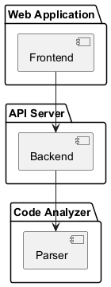

# Project-Based Learning (PBL) Report  
**Title:** UML Designer AI  
**Course:** Bachelor of Technology in Computer Science and Engineering (Course Code: [Placeholder])  
**Student Name:** [Student Name]  
**Roll Number:** [Roll Number]  
**Faculty Guide:** [Guide Name]  
**Department:** Department of Computer Science and Engineering, Geethanjali College of Engineering and Technology  
**Academic Year:** A.Y. 2025–26  

---

## 1. Introduction

UML Designer AI is an open-source, full-stack platform designed to automate the generation, analysis, and visualization of Unified Modeling Language (UML) diagrams from source code or natural language prompts. The project addresses the real-world need for rapid, accurate software architecture visualization, bridging communication gaps between technical and non-technical stakeholders.  
The motivation stems from the complexity of modern software systems and the necessity for clear documentation and design communication. The system enables users—developers, students, analysts—to convert codebases or requirements into professional UML diagrams, supporting collaboration and understanding.  
**Learning objectives** include mastering full-stack development, API design, code analysis, and the application of software engineering principles such as modularity, security, and testing.  
**Technologies used:** Node.js (Express.js), Python (Flask), React (Next.js), Tailwind CSS, PlantUML, and AI/LLM integration for enhanced code analysis.

---

## 2. System Design

### System Architecture

UML Designer AI follows a modular, client-server architecture:

- **Frontend:** React-based web application for user interaction, diagram rendering, and export.
- **Backend:** Node.js Express API gateway, handling requests, caching, security, and proxying to the parser.
- **Python Parser Microservice:** Analyzes code repositories, infers relationships, and generates normalized schema for UML diagrams.

The flow of control is as follows:  
User → Frontend → Backend → Python Parser → Backend → Frontend → User

### Modules

- **Frontend:**  
  - User interface for input (code or prompt), diagram visualization, and export.
  - Components: `HomePage`, `PlantUMLDiagram`, `GlobalErrorBoundary`.
- **Backend:**  
  - API routing (`api.js`), caching (memory/disk), security (CORS, validation), logging, monitoring.
  - Endpoints: `/analyze` (POST for code/prompt analysis).
- **Python Parser:**  
  - Language-specific analyzers (Python, Java, C#, etc.), relationship detection, AI enhancement, schema normalization.
  - Modules: `analyze.py`, `analyzers/`, `relationship/`, `plantuml/`.

### Backend Design

- **Database/Storage:**  
  - No traditional database; uses disk-based cache for analysis results.
  - Caching strategy: LRU in-memory and persistent disk cache keyed by repository URL and commit hash.

### Diagrams (Embedded)

Below are the primary UML diagrams generated for this project. These images reference the local `diagrams/` folder and will render directly on GitHub after pushing this repository.

Class Diagram (core classes and relationships):


Use Case Diagram (user interactions and features):


Activity Diagram (workflow):


State Diagram (system states):


Sequence Diagram (request flow):


Component Diagram (modules and connections):



Communication Diagram (component messaging):


Deployment Diagram (deployment topology):


*All images are stored in the repository's `diagrams/` directory; when this repository is pushed to GitHub these figures will be visible directly in the rendered Markdown.*

---


---

## 3. Implementation

### Module Integration

- **Frontend:**  
  - Built with Next.js and React, using Tailwind CSS for styling.
  - `PlantUMLDiagram.js` renders diagrams using PlantUML server, handles errors, and supports SVG/PNG export.
- **Backend:**  
  - Express.js routes requests, applies rate limiting, validates input, and manages cache.
  - Security features include CORS, request size limits, and input sanitization.
  - Logging and monitoring via Winston and custom metrics.
- **Python Parser:**  
  - Uses AST parsing for Python, `javalang` for Java, regex for other languages.
  - Relationship detection via `RelationshipDetector`.
  - AI enhancement (optional) using Groq/OpenAI-compatible API.

### Key Code Snippets

**1. Python File Analysis (PythonAnalyzer):**
```python
def analyze_file(self, file_path: str, package_path: str = "") -> List[Dict]:
    classes = []
    with open(file_path, 'r', encoding='utf-8', errors='ignore') as f:
        source = f.read()
    tree = ast.parse(source)
    self._extract_imports(tree)
    for node in ast.walk(tree):
        if isinstance(node, ast.ClassDef):
            class_dict = self._analyze_class(node, package_path)
            if class_dict:
                classes.append(class_dict)
                self.add_class_name(class_dict['class'])
    return classes
```
*Extracts classes, fields, and methods from Python files using AST.*

**2. Java File Analysis (JavaAnalyzer):**
```python
def analyze_file(self, file_path: str, package_path: str = "") -> List[Dict]:
    classes = []
    with open(file_path, 'r', encoding='utf-8', errors='ignore') as f:
        source = f.read()
    tree = javalang.parse.parse(source)
    for path_nodes, cls in tree.filter(javalang.tree.ClassDeclaration):
        class_dict = self._analyze_class(cls, tree, source, package_path)
        if class_dict:
            classes.append(class_dict)
            self.add_class_name(class_dict['class'])
    return classes
```
*Uses `javalang` to parse Java files and extract class/interface details.*

**3. Relationship Detection:**
```python
def validate_relationships(self) -> List[Dict]:
    valid_relationships = []
    for rel in self.relationships:
        if self._is_valid_relationship(rel):
            valid_relationships.append(rel)
    return valid_relationships
```
*Validates and deduplicates relationships between classes.*

**4. API Request Flow (Backend):**
```javascript
router.post('/analyze', asyncHandler(async (req, res) => {
  // Validate input, check cache, proxy to Python parser, return result
}));
```
*Handles analysis requests, applies caching and security checks.*

**5. Frontend Diagram Rendering (React):**
```javascript
export default function PlantUMLDiagram({ uml, format = 'svg', server }) {
  const encoded = plantumlEncoder.encode(uml);
  const src = `${server}/${format}/${encoded}`;
  return ;
}
```
*Renders UML diagrams in the frontend using PlantUML server.*

**6. Caching Strategy (Backend):**
```javascript
const cacheKey = (url, commit) => (commit ? `${url}@${commit}` : url);
// ...existing code...
if (memoryCache.has(cacheKey)) {
  return memoryCache.get(cacheKey);
}
```
*Implements cache key generation and lookup for backend caching.*

### Sample Output (Described)

- **API Response:**  
  Returns a JSON schema with detected classes, fields, methods, and relationships for each language.
- **Frontend Render:**  
  User submits code or prompt, receives interactive UML diagram (SVG/PNG), with options to export or share.

### APIs, Libraries, Frameworks

- **Backend:** Express.js, Winston, Multer, Axios, PM2, CORS, compression.
- **Frontend:** Next.js, React, Tailwind CSS, PlantUML encoder.
- **Python Parser:** Flask, javalang, ast, diskcache, Groq/OpenAI API.

---

## 4. Conclusion

UML Designer AI successfully automates the generation and visualization of UML diagrams from code and natural language, meeting its objectives of improving software documentation and communication.  
**Challenges:**  
- Multi-language parsing required robust AST and regex handling.
- Ensuring security and performance in API design.
- Integrating AI for enhanced analysis accuracy.

Solutions included modular architecture, comprehensive testing, and layered caching.  
**Key takeaways:**  
- Full-stack development and microservice integration.
- Application of software engineering principles in real-world scenarios.
- Impact: The project streamlines documentation, aids learning, and supports collaborative design.

---

## 5. References

1. Node.js Documentation: https://nodejs.org/
2. Express.js Documentation: https://expressjs.com/
3. React Documentation: https://react.dev/
4. Next.js Documentation: https://nextjs.org/
5. Python Documentation: https://python.org/
6. Flask Documentation: https://flask.palletsprojects.com/
7. javalang Library: https://github.com/c2nes/javalang
8. PlantUML: https://plantuml.com/
9. Tailwind CSS: https://tailwindcss.com/
10. Groq/OpenAI API Documentation: https://platform.openai.com/docs/
11. Winston Logger: https://github.com/winstonjs/winston
12. Diskcache: https://grantjenks.com/docs/diskcache/
13. Project README and source code files

---

**Note:**  
UML diagrams referenced in this report are conceptually described and available in the project’s `/diagrams` folder and README.  
Student and faculty details are placeholders and should be updated for final submission.
