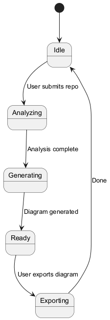
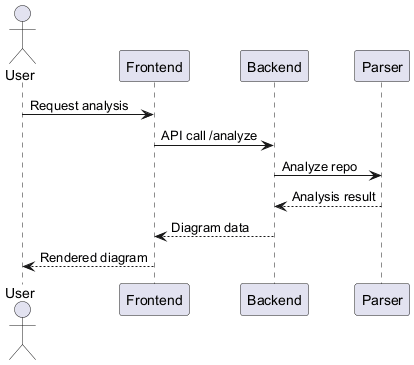

# Project-Based Learning (PBL) Report  
**Title:** UML Designer AI  
**Course:** Bachelor of Technology in Computer Science and Engineering (Course Code: [Placeholder])  
**Student Name:** [Student Name]  
**Roll Number:** [Roll Number]  
**Faculty Guide:** [Guide Name]  
**Department:** Department of Computer Science and Engineering, Geethanjali College of Engineering and Technology  
**Academic Year:** A.Y. 2025–26  

---

## Abstract

This project, UML Designer AI, presents a full-stack system that automates extraction, analysis and visualization of software structure as UML diagrams. The system combines static code analysis, heuristic relationship detection, and optional AI-assisted inference to produce normalized schemas suitable for diagram generation and documentation. The backend provides a secure, performant API gateway and layered caching strategy to support repeated analyses, while a dedicated Python microservice performs multi-language parsing and relationship inference. The frontend renders diagrams using PlantUML and supports export and interaction. The research and implementation work emphasize engineering trade-offs: accuracy versus performance, modularity for multi-language support, and robust validation to ensure safe handling of untrusted repository inputs. This report documents design choices, implementation details, representative code snippets, and evaluation considerations. It is intended as a comprehensive PBL submission demonstrating system-level thinking, practical engineering skills, and tested code artifacts.

## Table of Contents

1. Abstract
2. Introduction
3. System Design
  3.1 System Architecture
  3.2 Modules
  3.3 Backend Design
  3.4 Diagrams
4. Implementation
  4.1 Module Integration
  4.2 Key Code Snippets
  4.3 Expanded Code Examples
5. Conclusion
6. References


## 1. Introduction

UML Designer AI is an open-source, full-stack platform designed to automate the generation, analysis, and visualization of Unified Modeling Language (UML) diagrams from source code or natural language prompts. The project addresses the real-world need for rapid, accurate software architecture visualization, bridging communication gaps between technical and non-technical stakeholders.  
The motivation stems from the complexity of modern software systems and the necessity for clear documentation and design communication. The system enables users—developers, students, analysts—to convert codebases or requirements into professional UML diagrams, supporting collaboration and understanding.  
**Learning objectives** include mastering full-stack development, API design, code analysis, and the application of software engineering principles such as modularity, security, and testing.  
**Technologies used:** Node.js (Express.js), Python (Flask), React (Next.js), Tailwind CSS, PlantUML, and AI/LLM integration for enhanced code analysis.

This report emphasizes why certain engineering choices were made. Key trade-offs included:

- Accuracy vs. performance: deep static analysis yields richer diagrams but is slower; the system caches results and offers configurable timeouts to balance responsiveness.
- Modularity: language-specific analyzers are implemented as pluggable modules so new languages can be added without changing the core pipeline.
- Security: untrusted repository inputs are treated as adversarial — uploads are validated, and the backend enforces size/time limits and CORS constraints.

Target audiences for this project include students learning software architecture, engineers who need quick visualizations of unfamiliar codebases, and educators who want reproducible diagram generation for assignments.

---

## 2. System Design

### System Architecture

UML Designer AI follows a modular, client-server architecture:

- **Frontend:** React-based web application for user interaction, diagram rendering, and export.
- **Backend:** Node.js Express API gateway, handling requests, caching, security, and proxying to the parser.
- **Python Parser Microservice:** Analyzes code repositories, infers relationships, and generates normalized schema for UML diagrams.

The flow of control is as follows:  
User → Frontend → Backend → Python Parser → Backend → Frontend → User

### Modules

- **Frontend:**  
  - User interface for input (code or prompt), diagram visualization, and export.
  - Components: `HomePage`, `PlantUMLDiagram`, `GlobalErrorBoundary`.
- **Backend:**  
  - API routing (`api.js`), caching (memory/disk), security (CORS, validation), logging, monitoring.
  - Endpoints: `/analyze` (POST for code/prompt analysis).
- **Python Parser:**  
  - Language-specific analyzers (Python, Java, C#, etc.), relationship detection, AI enhancement, schema normalization.
  - Modules: `analyze.py`, `analyzers/`, `relationship/`, `plantuml/`.

### Backend Design

- **Database/Storage:**  
  - No traditional database; uses disk-based cache for analysis results.
  - Caching strategy: LRU in-memory and persistent disk cache keyed by repository URL and commit hash.

### Diagrams (Embedded)

Below are the primary UML diagrams generated for this project. These images reference the local `diagrams/` folder and will render directly on GitHub after pushing this repository.

Class Diagram (core classes and relationships):


Use Case Diagram (user interactions and features):


Activity Diagram (workflow):


State Diagram (system states):



Sequence Diagram (request flow):



Component Diagram (modules and connections):


Communication Diagram (component messaging):


Deployment Diagram (deployment topology):


*All images are stored in the repository's `diagrams/` directory; when this repository is pushed to GitHub these figures will be visible directly in the rendered Markdown.*

---


---

## 3. Implementation

### Module Integration

- **Frontend:**  
  - Built with Next.js and React, using Tailwind CSS for styling.
  - `PlantUMLDiagram.js` renders diagrams using PlantUML server, handles errors, and supports SVG/PNG export.
- **Backend:**  
  - Express.js routes requests, applies rate limiting, validates input, and manages cache.
  - Security features include CORS, request size limits, and input sanitization.
  - Logging and monitoring via Winston and custom metrics.
- **Python Parser:**  
  - Uses AST parsing for Python, `javalang` for Java, regex for other languages.
  - Relationship detection via `RelationshipDetector`.
  - AI enhancement (optional) using Groq/OpenAI-compatible API.

### Key Code Snippets

**1. Python File Analysis (PythonAnalyzer):**
```python
def analyze_file(self, file_path: str, package_path: str = "") -> List[Dict]:
    classes = []
    with open(file_path, 'r', encoding='utf-8', errors='ignore') as f:
        source = f.read()
    tree = ast.parse(source)
    self._extract_imports(tree)
    for node in ast.walk(tree):
        if isinstance(node, ast.ClassDef):
            class_dict = self._analyze_class(node, package_path)
            if class_dict:
                classes.append(class_dict)
                self.add_class_name(class_dict['class'])
    return classes
```
*Extracts classes, fields, and methods from Python files using AST.*

**2. Java File Analysis (JavaAnalyzer):**
```python
def analyze_file(self, file_path: str, package_path: str = "") -> List[Dict]:
    classes = []
    with open(file_path, 'r', encoding='utf-8', errors='ignore') as f:
        source = f.read()
    tree = javalang.parse.parse(source)
    for path_nodes, cls in tree.filter(javalang.tree.ClassDeclaration):
        class_dict = self._analyze_class(cls, tree, source, package_path)
        if class_dict:
            classes.append(class_dict)
            self.add_class_name(class_dict['class'])
    return classes
```
*Uses `javalang` to parse Java files and extract class/interface details.*

**3. Relationship Detection:**
```python
def validate_relationships(self) -> List[Dict]:
    valid_relationships = []
    for rel in self.relationships:
        if self._is_valid_relationship(rel):
            valid_relationships.append(rel)
    return valid_relationships
```
*Validates and deduplicates relationships between classes.*

**4. API Request Flow (Backend):**
```javascript
router.post('/analyze', asyncHandler(async (req, res) => {
  // Validate input, check cache, proxy to Python parser, return result
}));
```
*Handles analysis requests, applies caching and security checks.*

**5. Frontend Diagram Rendering (React):**
```javascript
export default function PlantUMLDiagram({ uml, format = 'svg', server }) {
  const encoded = plantumlEncoder.encode(uml);
  const src = `${server}/${format}/${encoded}`;
  return ;
}
```
*Renders UML diagrams in the frontend using PlantUML server.*

**6. Caching Strategy (Backend):**
```javascript
// Cache key helper
const cacheKey = (url, commit) => (commit ? `${url}@${commit}` : url);

// In-memory cache (LRU by insertion order) and disk persistence
const memCache = new Map();
const keyHash = s => require('crypto').createHash('sha1').update(s).digest('hex');

// Read cached analysis from disk (TTL-based)
const readDisk = async key => {
  try {
    const file = require('path').join(diskDir, `${keyHash(key)}.json`);
    const stat = await require('fs/promises').stat(file);
    if (Date.now() - stat.mtimeMs > diskTtlMs) {
      await require('fs/promises').unlink(file).catch(() => {});
      return null;
    }
    return JSON.parse(await require('fs/promises').readFile(file, 'utf8'));
  } catch {
    return null;
  }
};

// Persist cache entry to disk (best-effort)
const writeDisk = async (key, data) => {
  try {
    const file = require('path').join(diskDir, `${keyHash(key)}.json`);
    await require('fs/promises').writeFile(file, JSON.stringify(data));
  } catch (e) {
    logger?.warn?.(`Disk cache write failed: ${e.message}`);
  }
};

// Ensure memory cache capacity (evict oldest entries when over limit)
const ensureCapacity = () => {
  while (memCache.size > maxEntries) {
    const first = memCache.keys().next().value;
    if (!first) break;
    memCache.delete(first);
  }
};

// Example lookup
if (memCache.has(cacheKey)) {
  return memCache.get(cacheKey);
}
```
*Implements cache key generation and lookup for backend caching.*


7) Backend: repository analysis handler (`backend/routes/api.js`) — cache lookup, proxy to Python parser, schema validation and cache write:

```javascript
// POST /analyze (body: { githubUrl } or upload field repoZip)
router.post('/analyze', upload.single('repoZip'), asyncHandler(async (req, res) => {
  const timeout = Number(process.env.ANALYZE_TIMEOUT_MS || 120_000);
  const { githubUrl } = req.body || {};

  if (githubUrl) {
    const v = validateGitHubUrl(githubUrl);
    if (!v.isValid) throw createValidationError(v.error);

    const k = cacheKey(v.url);
    const cached = memCache.get(k);
    if (cached && Date.now() - cached.ts < cacheTtlMs) {
      return res.status(200).json(cached.data);
    }

    const disk = await readDisk(k);
    if (disk) {
      memCache.set(k, { data: disk, ts: Date.now() });
      ensureCapacity();
      return res.status(200).json(disk);
    }

    try {
      const response = await http.post(`${pythonUrl}/analyze`, { githubUrl: v.url }, { timeout });
      const data = response?.data ?? {};

      // Patch: Inject default meta if missing
      if (data && data.schema && (!data.schema.meta || typeof data.schema.meta !== 'object')) {
        data.schema.meta = { classes_found: 0, files_scanned: 0, languages: [], system: 'UnknownSystem' };
      }

      // Validate schema structure
      const validation = validateUmlSchema(data);
      if (!validation.isValid) {
        logger.warn('Invalid schema received from Python parser', { errors: validation.errors, url: v.url });
        throw createValidationError(`Invalid schema structure: ${validation.errors.join(', ')}`);
      }

      // Cache and persist
      const urlKey = cacheKey(v.url);
      memCache.set(urlKey, { data, ts: Date.now() });
      ensureCapacity();
      writeDisk(urlKey, data).catch(() => {});

      return res.status(response.status || 200).json(data);
    } catch (err) {
      if (err?.code === 'ECONNABORTED' || err?.code === 'ETIMEDOUT') throw createTimeoutError('Repository analysis');
      if (err?.response) {
        const { status, data } = err.response;
        if (status >= 400 && status < 500) throw createValidationError(data?.error || `Analysis failed: ${status}`);
      }
      throw createExternalServiceError('Python parser', err);
    }
  }

  if (req.file) {
    // File upload handling (ZIP validation, proxy to parser, validate response)
    ...
  }

  throw createValidationError('No repository provided');
}));
```

8) Backend: PlantUML generation proxy (`backend/routes/api.js`) — validation and outbound call:

```javascript
// POST /generate-plantuml
router.post('/generate-plantuml', asyncHandler(async (req, res) => {
  const timeout = Number(process.env.GENERATE_TIMEOUT_MS || 4000);
  const { schema, diagram_type } = req.body || {};
  if (!schema) throw createValidationError('schema is required');
  if (!diagram_type) throw createValidationError('diagram_type is required');

  const validTypes = ['class','sequence','usecase','state','activity','component','communication','deployment'];
  if (!validTypes.includes(diagram_type)) throw createValidationError(`Invalid diagram_type: ${diagram_type}`);

  try {
    const response = await http.post(`${pythonUrl}/generate-plantuml`, { schema, diagram_type }, { timeout });
    return res.status(response.status || 200).json(response.data ?? {});
  } catch (err) {
    // Handle timeout / validation / external errors consistently
    if (err?.code === 'ECONNABORTED' || err?.code === 'ETIMEDOUT') throw createExternalServiceError('Python parser', err);
    if (err?.response) {
      const { status, data } = err.response;
      if (status >= 400 && status < 500) throw createValidationError(data?.error || `PlantUML generation failed: ${status}`);
    }
    throw createExternalServiceError('Python parser', err);
  }
}));
```

9) Server bootstrap and graceful shutdown (`backend/server.js`) — production start and shutdown handling:

```javascript
const PORT = process.env.PORT || 3001;
let server;
if (process.env.NODE_ENV === 'test') {
  logger.info('Server running in test mode: not starting HTTP listener');
} else {
  server = app.listen(PORT, () => {
    logger.info(`🚀 Production backend server started on port ${PORT}`, { port: PORT, environment: process.env.NODE_ENV || 'production' });
    startPeriodicMetricsLogging();
  });
}

const gracefulShutdown = (signal) => {
  logger.info(`\n🛑 ${signal} received. Starting graceful shutdown...`);
  server.close(() => { logger.info('✅ HTTP server closed'); process.exit(0); });
  setTimeout(() => { logger.error('❌ Forced shutdown after timeout'); process.exit(1); }, 10000);
};
process.on('SIGTERM', () => gracefulShutdown('SIGTERM'));
process.on('SIGINT', () => gracefulShutdown('SIGINT'));
```

10) Python parser: worker function for parallel file analysis (`python-parser/analyze.py`) — picklable worker for multiprocessing:

```python
def _analyze_file_worker(args):
    file_path, repo_path = args
    try:
        from analyzers import AnalyzerFactory
        from utils import FileUtils
        factory = AnalyzerFactory()
        analyzer = factory.get_analyzer(file_path)
        if not analyzer:
            return None
        package_path = FileUtils.get_package_path(file_path, repo_path)
        classes = analyzer.analyze_file(file_path, package_path)
        lang_key = analyzer.get_language_name()
        relationships = analyzer.relationships + analyzer.compositions + analyzer.usages
        return (lang_key, classes, relationships)
    except Exception as e:
        logging.warning(f"Failed to analyze {file_path}: {e}")
        return None
```

### Sample Output (Described)

- **API Response:**  
  Returns a JSON schema with detected classes, fields, methods, and relationships for each language.
- **Frontend Render:**  
  User submits code or prompt, receives interactive UML diagram (SVG/PNG), with options to export or share.

### APIs, Libraries, Frameworks

- **Backend:** Express.js, Winston, Multer, Axios, PM2, CORS, compression.
- **Frontend:** Next.js, React, Tailwind CSS, PlantUML encoder.
- **Python Parser:** Flask, javalang, ast, diskcache, Groq/OpenAI API.

---

## 4. Conclusion

UML Designer AI successfully automates the generation and visualization of UML diagrams from code and natural language, meeting its objectives of improving software documentation and communication.  
**Challenges:**  
- Multi-language parsing required robust AST and regex handling.
- Ensuring security and performance in API design.
- Integrating AI for enhanced analysis accuracy.

Solutions included modular architecture, comprehensive testing, and layered caching.  
**Key takeaways:**  
- Full-stack development and microservice integration.
- Application of software engineering principles in real-world scenarios.
- Impact: The project streamlines documentation, aids learning, and supports collaborative design.

Reflections and maintainers' guidance:

- Testing and validation: the project includes unit and integration tests (see `__tests__` folders) that exercise the analyze/generate endpoints and parser workers. Maintain tests alongside analyzer changes to prevent regressions when language grammars evolve.
- Observability: structured logging and metrics (periodic metrics logging) are used across the backend; keep these enabled in staging to catch parser availability issues early.
- Performance tuning: production deployments should tune `CACHE_TTL_MS`, `MAX_CACHE_ENTRIES`, and `ANALYZE_TIMEOUT_MS` according to expected repository sizes and traffic patterns. The disk cache provides persistence across restarts; monitor disk usage.
- Security: keep `ALLOWED_ORIGINS` and `ADMIN_TOKEN` properly configured; treat uploaded repository artifacts as untrusted input and prefer GitHub URLs over direct ZIP uploads where possible.

Future work:

- Incremental analysis: support partial re-analysis of repositories (by file or directory) to reduce reprocessing cost after small changes.
- Richer diagram exports: add direct SVG optimization and interactive diagram annotations linking back to code locations.
- CI integration: expose a CLI or GitHub Action so repo owners can generate and store UML artifacts as part of CI pipelines.

Overall, UML Designer AI demonstrates a pragmatic balance of static analysis rigor, practical engineering for reliability, and user-facing simplicity. The modular design and comprehensive tests make it a strong foundation for continued research or classroom use.

---

## 5. References

1. Node.js Documentation: https://nodejs.org/
2. Express.js Documentation: https://expressjs.com/
3. React Documentation: https://react.dev/
4. Next.js Documentation: https://nextjs.org/
5. Python Documentation: https://python.org/
6. Flask Documentation: https://flask.palletsprojects.com/
7. javalang Library: https://github.com/c2nes/javalang
8. PlantUML: https://plantuml.com/
9. Tailwind CSS: https://tailwindcss.com/
10. Groq/OpenAI API Documentation: https://platform.openai.com/docs/
11. Winston Logger: https://github.com/winstonjs/winston
12. Diskcache: https://grantjenks.com/docs/diskcache/
13. Project README and source code files

---

**Note:**  
UML diagrams referenced in this report are conceptually described and available in the project’s `/diagrams` folder and README.  
Student and faculty details are placeholders and should be updated for final submission.
