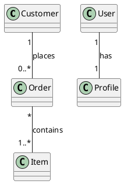
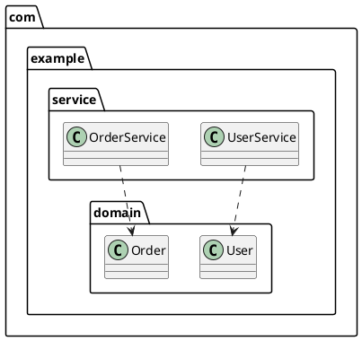
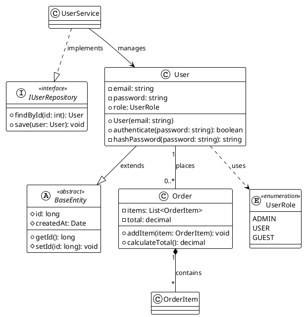

# UML Designer AI

**Multi-Language, Multi-Diagram UML Generator — PlantUML is the canonical renderer**

---

## Why we migrated to PlantUML

We standardized on PlantUML as the canonical rendering format for three reasons:

- Accuracy: PlantUML provides fuller UML 2.0 support (stereotypes, visibility modifiers, multiplicities, and precise arrow semantics) which reduces ambiguity in documentation.
- Professional output: PlantUML produces visuals suited for formal documentation, diagrams in reports, and publication-quality exports (SVG/PNG/PDF).
- Interoperability: PlantUML syntax is widely supported by editors, CI toolchains, and enterprise documentation pipelines, making it easier to integrate diagrams into existing processes.

The parser may emit alternate legacy textual outputs for specific tooling workflows, but the UI, API, and docs treat PlantUML as the single supported format for rendering and exports.


## 🚀 Features

- **Primary Rendering: PlantUML (UML 2.0)** — the frontend UI generates and renders PlantUML diagrams as the canonical, production-quality output. The parser/LLM produces PlantUML as the canonical output for rendering and export.
- **All Major UML Types:** Class, Use Case, Activity, Sequence, State, Communication, Component, Deployment
- **StarUML-like Output:** Diagrams match conventions of professional drag-and-drop tools
- **Multi-Language Parsing:** Python, Java, C#, TypeScript, JavaScript, C++, C
- **AI-Enhanced:** Optional LLM for improved relationship and entity detection
- **Advanced Relationship Detection:** Inheritance, composition, aggregation, dependency, implements, association
- **Interactive UI:** Diagram type selector, copy/export, error feedback (PlantUML is the supported UI format)
- **Robust Error Handling:** Invalid syntax is caught and explained, with raw code shown for debugging

---

## 🏗️ Architecture

```
Frontend (Next.js + React + Tailwind + PlantUML)
  ↓
Backend (Express.js Proxy + Caching)
  ↓
# Python Parser (Flask + Multi-Language AST + AI)

> Repository scan (automated): The codebase was scanned and the README updated to reflect reality. Key findings:

> - Frontend: Next.js (ports/scripts confirmed in `frontend/package.json`).
> - Backend: Express.js (start script `npm start` runs `server.js`, default port configurable via `PORT`, backend expects Python parser at `PYTHON_PARSER_URL`).
> - Python parser: current runtime is a Flask app (`python-parser/app.py` runs Flask on port 5000). However, `python-parser/requirements.txt` also lists `fastapi` and `uvicorn` — this is a documented mismatch (Flask code + FastAPI in requirements). See "Parser framework mismatch" later in this README for actions.

# UML Designer AI — Consolidated Documentation

An AI-powered multi-language UML generator that analyzes code repositories or natural-language prompts and renders professional diagrams using PlantUML (UML 2.0 compliant). PlantUML is the canonical, production-ready format used by the UI and documentation.

This repository contains three main parts:
- Frontend: Next.js + React UI for user input and diagram rendering
- Backend: Express.js API proxy, caching, validation and orchestration
- Python Parser: Flask service that analyzes repositories and (optionally) uses an LLM to enrich the analysis

This README consolidates the project's key usage, run instructions, troubleshooting, and examples from smaller docs so everything you need is in one place.

## What this repo does

- Analyze public GitHub repositories (or uploaded zips) to produce a normalized analysis schema (classes, methods, fields, relations, endpoints, meta)
- Generate diagrams from that schema (PlantUML canonical output) for multiple UML diagram types: class, sequence, activity, state, usecase, component, communication, deployment
- Accept natural-language prompts and ask the LLM to produce diagram source (PlantUML canonical output) with robust prompt templates and validation
- Provide a single-page UI to explore, filter by language, and export diagrams

## Quick start (local development)

Prerequisites: Node.js (18+), Python (3.8+), Git

1) Install dependencies

```powershell
# Backend
cd C:\Users\saita\OneDrive\Desktop\Projects\UML\backend
npm install

# Frontend
cd ..\frontend
npm install

# Python parser
cd ..\python-parser
pip install -r requirements.txt
```
2) Start services (open three terminals)

```powershell
# Terminal 1: Python parser (default port 5000)
cd C:\Users\saita\OneDrive\Desktop\Projects\UML\python-parser
python app.py

# Terminal 2: Backend API (default port 3001)
cd C:\Users\saita\OneDrive\Desktop\Projects\UML\backend
npm start

# Terminal 3: Frontend (Next.js, default port 3000)
cd C:\Users\saita\OneDrive\Desktop\Projects\UML\frontend
npm run dev
```

Open http://localhost:3000 in your browser.

Notes:
- The frontend talks to the backend (default http://localhost:3001). Configure `NEXT_PUBLIC_BACKEND_URL` in `frontend/.env.local` if different.
- The backend proxies `POST /generate-plantuml` and `POST /analyze` to the Python parser (default `http://localhost:5000` unless `PYTHON_PARSER_URL` env var is set).

Next steps (recommended):

1. Decide how to resolve the parser framework mismatch:
  - Option A — Keep Flask: remove `fastapi`/`uvicorn` from `python-parser/requirements.txt` and update docs to state Flask is the runtime. Low-risk.
  - Option B — Migrate to FastAPI: port `python-parser/app.py` to FastAPI and update tests/start commands to use `uvicorn`. Moderate effort but modern async stack.

Tell me which option you prefer and I will implement the change and run the test suites.

## Common workflows

- Repo → UML: paste a public GitHub repo URL on the homepage → select diagram type → click Analyze → tune language filters → export
- Prompt → UML: open the Prompt page → provide a natural language prompt → the app asks the LLM to return diagram source directly → switch formats/types without retyping (auto-regeneration)

## Diagram types supported

- class, sequence, activity, state, usecase, component, communication, deployment

The parser produces PlantUML as the canonical format for diagram generation. In limited cases the parser may also emit legacy textual outputs for offline or converter tooling, but the UI and documentation assume PlantUML for rendering and export.

## Troubleshooting

If you see PlantUML 400 errors:
  - Ensure the backend (port 3001) and python parser (port 5000) are running.
  - Copy the PlantUML source ("Copy PlantUML") and paste into the PlantUML online editor to inspect syntax.

- If the frontend cannot reach the backend, check `NEXT_PUBLIC_BACKEND_URL` in `.env.local` or the environment.

- Large diagrams can time out on the PlantUML server. Reduce diagram size with language filters or export and render locally.

## Quick tests & example prompts

Use these prompts in the Prompt-to-UML page to validate behavior (merged from the old `TEST_PROMPTS.md`):
  "ATM System: User inserts card, system reads card, user enters PIN, select transaction: withdraw/deposit/balance inquiry. For withdrawal: check balance, dispense cash, print receipt."

- E-commerce checkout (sequence/class):
- Order lifecycle (state):
  "Order lifecycle: Draft -> Pending -> Shipped -> Delivered -> Returned"

## Running quick service checks

Save this as `test-services.ps1` (optional) and run it to verify local services:

```powershell
Write-Host "Checking services..."
try { Invoke-WebRequest http://localhost:5000/health -UseBasicParsing -TimeoutSec 2; Write-Host "Python parser OK" } catch { Write-Host "Python parser unreachable" }
try { Invoke-WebRequest http://localhost:3001/health -UseBasicParsing -TimeoutSec 2; Write-Host "Backend OK" } catch { Write-Host "Backend unreachable" }
try { Invoke-WebRequest http://localhost:3000 -UseBasicParsing -TimeoutSec 2; Write-Host "Frontend OK" } catch { Write-Host "Frontend unreachable" }
```

## Development notes & where to look

- Frontend: `frontend/components/HomePage.js`, `frontend/utils/diagramBuilder.js`, `frontend/components/PlantUMLDiagram.js`
- Backend: `backend/routes/api.js`, `backend/server.js`

## Merged content & removed files

To keep docs centralized, several auxiliary markdown files have been merged into this README. The following files were removed from the top-level docs to avoid fragmentation (their important content is consolidated here):

- `START_ALL_SERVICES.md` (run/run-check instructions)
- `V3.0_READY_FOR_PRODUCTION.md` (release notes summary)
- `V3.0_SESSION_SUMMARY.md` (detailed session summary)

If you need to recover a removed file, check your git history (these deletes are committed in branch changes and can be restored with git if required).

## Contributing
- Fork, add tests, run the test suite and open a PR. Frontend uses Jest, backend uses Jest, and Python tests use pytest.
#### **4. Multiplicities**
Show cardinality of relationships:



**Notation**:
- `1` = Exactly one
- `*` = Zero or more
- `0..1` = Optional (zero or one)
- `1..*` = One or more
- `m..n` = Between m and n

---

#### **5. Package Grouping**
Organize classes by namespace/package:



---

### **Complete Class Diagram Example**



---

### **How to Use PlantUML in This App**

1. **Analyze a Repository**
   - Enter GitHub URL
   - Click "Analyze"

2. **PlantUML is shown by default**
  - The UI renders PlantUML automatically. Use the export buttons to copy PlantUML text or download rendered SVG/PNG.

3. **See UML 2.0 Features**
   - Stereotypes: `<<interface>>`, `<<abstract>>`
   - Visibility: `+`, `-`, `#`, `~`
   - Proper arrows: `--|>`, `..|>`, `*--`, etc.
   - Professional appearance

4. **Export Options**
   - **Copy PlantUML**: Copy syntax to clipboard
   - **Download SVG**: Download as vector graphics
   - **View on PlantUML Server**: Opens in new tab

---

### **PlantUML Configuration**

The app generates PlantUML with these defaults:

```plantuml
@startuml
!theme plain              
skinparam classAttributeIconSize 0
skinparam shadowing false
skinparam roundcorner 5
skinparam class {
  BackgroundColor White
  BorderColor Black
  ArrowColor Black
}
@enduml
```

**Available Themes**: `plain`, `bluegray`, `amiga`, `aws-orange`, `mars`, `sketchy`

---

### **Troubleshooting PlantUML**

#### **"PlantUML rendering timed out"**
- **Cause**: Diagram too complex or server slow
- **Solution**: 
  - Reduce number of classes with language filters
  - Export PlantUML text and render locally (self-hosted PlantUML) or simplify the input
  - Try again in a few minutes

#### **"Network error while connecting to PlantUML server"**
- **Cause**: Internet connection or server unavailable
- **Solution**:
  - Check your internet connection
  - Try a self-hosted PlantUML instance or render the exported PlantUML text locally
  - Try again later

#### **Diagram looks incorrect**
- **Debug Steps**:
  1. Click "Copy PlantUML" button
  2. Paste into [PlantUML online editor](https://www.plantuml.com/plantuml)
  3. Check if syntax is valid
  4. Report issues on GitHub with generated code

#### **Want to self-host PlantUML?**
```bash
# Run local PlantUML server (Docker)
docker run -d -p 8080:8080 plantuml/plantuml-server:jetty

# Then update frontend component (PlantUMLDiagram.js):
const SERVER_URL = 'http://localhost:8080';
```

---

### **PlantUML Resources**

- **Official Documentation**: https://plantuml.com/
- **Class Diagram Guide**: https://plantuml.com/class-diagram
- **Sequence Diagram Guide**: https://plantuml.com/sequence-diagram
- **Online Editor**: https://www.plantuml.com/plantuml
- **VS Code Extension**: PlantUML by jebbs
- **UML 2.0 Specification**: https://www.omg.org/spec/UML/

---

## 🔄 Migration status

PlantUML is now the canonical and supported rendering format in the UI and documentation. The README and runtime behavior present PlantUML as the primary format; legacy textual outputs may be available for specific offline or tooling workflows.

How this affects users and developers:

- For users: No special action required. The UI displays PlantUML-rendered diagrams by default and export buttons provide PlantUML syntax and rendered assets.
- For developers: If running locally, ensure `plantuml-encoder` is available in the frontend build to support PlantUML URL encoding when rendering via the PlantUML server.

Developer install step (if building locally):

```bash
cd frontend
npm install plantuml-encoder
```

If you need an alternate textual format for offline or converter tooling, export the analysis schema and convert it using internal scripts — PlantUML remains the canonical UI render and the preferred format for exports.

---

### **FAQ**

#### **Do I have to use PlantUML?**
PlantUML is the supported default and recommended format for the UI and exported diagrams. Use PlantUML for final documentation; export the PlantUML text for offline rendering if needed.

#### **Will my existing diagrams break?**
Existing diagrams should continue to be available in the analysis schema. The UI focuses on PlantUML rendering and export; if you relied on Mermaid-specific features, convert exported schema using the provided tooling.

#### **Which format should I use?**
- **Daily development & quick reviews**: Use compact PlantUML snippets and small diagrams. PlantUML works well for quick iterations when kept small.
- **Final documentation**: Use PlantUML for UML 2.0 accuracy and publication-quality exports.
- **Offline work**: Export PlantUML text and render locally with a self-hosted PlantUML server.
- **GitHub README**: Embed exported SVG/PNG images generated from PlantUML for best compatibility.

#### **Can I switch between formats on the fly?**
The UI focuses on PlantUML as the supported format and does not include an end-user toggle to switch to alternative textual formats. If you need another format for tooling, export the schema and convert it separately.

#### **Does PlantUML work offline?**
PlantUML rendering requires an available PlantUML renderer (public server or a self-hosted instance). For fully offline workflows, export the PlantUML source and render it with a local PlantUML server or compatible tooling.

#### **Are there performance differences?**
- PlantUML rendering is typically server-based and may be slower than client-only renderers (expect ~1-2s depending on server). Use caching and language filters to speed up common workflows.

#### **Can I export other formats?**
Yes. The UI provides export options for PlantUML text and rendered assets (SVG/PNG). Export PlantUML text and convert it to other formats using provided tooling if necessary.

---

### **Feature Comparison Table**

| Feature | PlantUML | Notes |
|---------|----------|------|
| **Default Format** | ✅ Yes | PlantUML is the canonical UI format |
| **Speed** | ⏱️ ~1-2s | Rendering is server-based; use caching to improve speed |
| **Offline Support** | ⚠️ Limited | Export PlantUML text and render locally with a self-hosted server |
| **UML 2.0 Compliance** | ✅ Full | Stereotypes, visibility, multiplicities, and accurate arrows are supported |
| **Export Formats** | SVG, PNG, PDF | Multiple export options via PlantUML server |
| **Professional Look** | ✅ Excellent | Best for final documentation and publications |

---

### **Recommended Workflow**

```
┌─────────────────────────────────────────┐
│ Development Phase                        │
├─────────────────────────────────────────┤
│ Use PlantUML for:                        │
│ • Quick architecture reviews (compact PlantUML snippets)            │
│ • Rapid iteration during coding when diagrams are kept small         │
│ • Documentation (embed exported SVG/PNG)           │
│ • Offline/local development (export PlantUML and render locally)             │
└─────────────────────────────────────────┘
                    ↓
┌─────────────────────────────────────────┐
│ Documentation Phase                      │
├─────────────────────────────────────────┤
│ Use PlantUML for:                 │
│ • Final design documents                │
│ • Academic/enterprise deliverables      │
│ • Presentations to stakeholders         │
│ • Professional publications             │
└─────────────────────────────────────────┘
```

---

### **Known Limitations & Workarounds**

#### **PlantUML Server Dependency**
- **Limitation**: Requires an available PlantUML renderer (public server or self-hosted)
- **Workaround**: Export PlantUML text and render locally with a self-hosted PlantUML instance
- **Future**: Self-hosted PlantUML server option coming soon

#### **PlantUML Rendering Speed**
- **Limitation**: Server-based rendering may be slower than pure client-side renderers
- **Workaround**: Keep diagrams compact, use caching, or render locally with a self-hosted server for heavy workflows
- **Future**: Response caching will improve re-render speed

#### **Large Diagrams**
- **Limitation**: Very large repositories may timeout with PlantUML
- **Workaround**: Use language filters to reduce diagram complexity
- **Alternative**: Export PlantUML syntax and use local editor

---

### **Reporting Issues**

If you encounter problems with PlantUML:

1. **Check troubleshooting section** (above)
2. **Copy PlantUML syntax** and test in [online editor](https://www.plantuml.com/plantuml)
3. **Report on GitHub** with:
  - Steps to reproduce
  - Repository URL tested
  - Browser console errors
  - Generated PlantUML syntax (if applicable)

---


## 🧪 Testing

```bash
# Run all tests
cd backend && npm test
cd ../frontend && npm test
cd ../python-parser && python -m pytest

# Test coverage
cd python-parser && python -m pytest --cov=analyze
```

## 📚 API Documentation

### **Backend Endpoints**

#### `POST /api/analyze`
Analyze repository and return analysis schema (for PlantUML diagram generation).

**Request:**
```json
{
  "githubUrl": "https://github.com/user/repo"
}
```

**Response:**
```json
{
  "schema": {
    "python": [...],
    "java": [...],
    "relations": [...],
    "meta": {...}
  }
}
```

#### `POST /api/generate-plantuml` 🆕
Generate PlantUML diagram from analysis schema.

**Request:**
```json
{
  "schema": { /* analysis schema from /analyze */ },
  "diagram_type": "class",
  "language_filter": ["python", "java"],
  "config": {
    "theme": "plain",
    "show_methods": true,
    "show_fields": true,
    "show_private": false
  }
}
```

**Response:**
```json
{
  "plantuml": "@startuml\n!theme plain\n\nclass User <<abstract>> {\n  - id: int\n  + getName(): string\n}\n\n@enduml",
  "diagram_type": "class",
  "statistics": {
    "total_classes": 15,
    "total_relations": 23,
    "languages": ["python", "java"]
  },
  "success": true
}
```

#### `GET /api/health`
Service health check including Python parser status.

**Response:**
```json
{
  "ok": true,
  "status": "healthy",
  "services": {
    "pythonParser": "healthy"
  }
}
```

### **Python Parser API**

#### `POST /analyze`
Process repository and return analysis schema.

#### `POST /generate-plantuml` 🆕
Generate PlantUML syntax from schema (called by backend).

**Diagram Types Supported:**
- `class` - Class diagrams with full UML 2.0 features
- `sequence` - Sequence diagrams from endpoints
- `usecase` - Use case diagrams
- `state` - State machine diagrams
- `activity` - Activity workflow diagrams

## 🤝 Contributing

1. Fork the repository
2. Create a feature branch
3. Add tests for new functionality
4. Ensure all tests pass
5. Submit a pull request

## 📄 License

This project is licensed under the MIT License - see the LICENSE file for details.

---

**Made with ❤️ for software engineering education and professional UML diagramming**

## 🚀 Quick Start

1. **Start the Python Parser** (Port 5000)
   ```bash
   cd python-parser
   pip install -r requirements.txt
   python app.py
   ```

2. **Start the Backend** (Port 3001)
   ```bash
   cd backend
   npm install
   npm start
   ```

3. **Start the Frontend** (Port 3000)
   ```bash
   cd frontend
   npm install
   npm run dev
   ```

4. **Open http://localhost:3000** and paste any public GitHub repository URL!

## 🎯 Who This Is For

- **Product Managers & Stakeholders**: Get clear visual overviews of system architecture without diving into code
- **Software Engineers**: Quickly understand unfamiliar codebases, plan refactoring, or onboard new team members
- **Students & Educators**: Learn how real-world code translates to UML diagrams
- **Technical Writers**: Generate documentation diagrams automatically

## 🏗️ Architecture Overview

### Three-Tier Architecture
```
Frontend (Next.js + React + PlantUML)
  ↓ HTTP Requests
Backend (Express.js Proxy + Caching)
  ↓ Repository Analysis
Python Parser (Flask + Multi-Language AST + AI)
```

### **Frontend Layer** (`/frontend`)
- **Technology**: Next.js 13+, React, Tailwind CSS, PlantUML
- **Purpose**: User interface, diagram rendering, and interactive controls
- **Key Features**:
  - Client-side PlantUML rendering (encodes PlantUML and fetches rendered assets from a PlantUML server)
  - Language-specific color coding and visibility toggles
  - Real-time diagram filtering (fields, methods, relationships)
  - Copy PlantUML source and download SVG functionality

### **Backend Layer** (`/backend`) 
- **Technology**: Express.js, Node.js
- **Purpose**: API proxy, caching, and request optimization
- **Key Features**:
  - Intelligent caching (in-memory + disk) with TTL
  - Request timeout handling and rate limiting
  - CORS configuration and security headers
  - Repository upload support (ZIP files)

### **Parser Layer** (`/python-parser`)
- **Technology**: Python 3.10+, Flask, javalang, AST parsing
- **Purpose**: Multi-language code analysis and AI enrichment
- **Key Features**:
  - Static AST analysis for 7+ programming languages
  - Relationship inference (inheritance, composition, dependencies)
  - Optional AI enhancement via Groq API
  - Performance optimization (shallow clones, file size limits)

## 🔍 What It Analyzes

### **Supported Languages & Features**

| Language | Classes | Fields | Methods | Inheritance | Implements | Uses/Dependencies |
|----------|---------|--------|---------|-------------|------------|------------------|
| **Java** | ✅ | ✅ | ✅ | ✅ | ✅ | ✅ |
| **Python** | ✅ | ✅ | ✅ | ✅ | ❌ | 🔄 |
| **C#** | ✅ | ✅ | ✅ | ✅ | ✅ | 🔄 |
| **TypeScript** | ✅ | ✅ | ✅ | ✅ | ✅ | 🔄 |
| **JavaScript** | ✅ | ❌ | ✅ | ✅ | ❌ | 🔄 |
| **C++** | ✅ | ❌ | ✅ | ✅ | ❌ | 🔄 |
| **C** | ✅ | ❌ | ✅ | ❌ | ❌ | ❌ |

**Legend**: ✅ Fully Supported | 🔄 Roadmap | ❌ Not Applicable

### **Relationship Types Detected**
- **Inheritance** (`<|--`): Class extends another class
- **Interface Implementation** (`<|..`): Class implements an interface
- **Composition** (`*--`): Strong ownership relationship
- **Aggregation** (`o--`): Weak ownership relationship  
- **Dependency/Uses** (`..>`): Class depends on another class
- **Association** (`-->`): General relationship

## 📊 Data Flow & Processing

### **Input Processing**
1. **Repository Input**: GitHub URL or uploaded ZIP file
2. **Git Operations**: Shallow clone (depth=1) for performance
3. **File Discovery**: Recursive scan with intelligent filtering
4. **Language Detection**: File extension-based routing

### **Analysis Pipeline**
```
Raw Source Code
    ↓ Language-Specific Parsers
AST Extraction (Classes, Methods, Fields)
    ↓ Relationship Inference Engine  
Relationship Graph (Extends, Implements, Uses)
  ↓ AI Enhancement (Optional)
Enriched Schema (JSON)
  ↓ PlantUML Conversion
UML Class Diagram (Rendered)
```

### **Output Schema**
```json
{
  "python": [
    {
      "class": "ClassName",
      "fields": ["field1: type", "field2"],
      "methods": ["method1", "method2"]
    }
  ],
  "java": [...],
  "relations": [
    {
      "from": "BaseClass",
      "to": "DerivedClass", 
      "type": "extends",
      "source": "heuristic|ai"
    }
  ],
  "meta": {
    "commit": "abc123...",
    "files_scanned": 245
  }
}
```

## ⚙️ Configuration Guide

### **Environment Variables**

#### **Frontend** (`.env.local`)
```bash
NEXT_PUBLIC_BACKEND_URL=http://localhost:3001
```

#### **Backend** (`.env`)
```bash
# Core Configuration
PYTHON_PARSER_URL=http://localhost:5000
PORT=3001

# Performance & Limits
ANALYZE_TIMEOUT_MS=120000
JSON_LIMIT=5mb
UPLOAD_LIMIT_BYTES=52428800

# Caching Strategy
CACHE_TTL_MS=300000
DISK_CACHE_TTL_MS=86400000
MAX_CACHE_ENTRIES=200
DISK_CACHE_DIR=./cache

# Security
ALLOWED_ORIGINS=http://localhost:3000,https://yourdomain.com
```

#### **Python Parser** (`.env`)
```bash
# AI Configuration (Optional)
GROQ_API_KEY=your_groq_api_key_here
GROQ_MODEL=meta-llama/llama-4-scout-17b-16e-instruct
GROQ_API_URL=https://api.groq.com/openai/v1/chat/completions
STUB_LLM=false

# Performance Tuning
MAX_FILE_BYTES=500000
MAX_FILES=5000
GIT_CLONE_DEPTH=1

# Development
FLASK_ENV=development
```

## 🔧 Advanced Usage

### **Performance Optimization**
- **Large Repositories**: Increase `MAX_FILES` and `MAX_FILE_BYTES` gradually
- **Memory Usage**: Monitor cache size with `MAX_CACHE_ENTRIES`
- **Network**: Use `GIT_CLONE_DEPTH=1` for faster clones
- **CPU**: Set `ANALYZE_TIMEOUT_MS` based on expected repository size

### **AI Enhancement**
- **With AI**: Rich relationship detection, better field/method naming
- **Without AI**: Fast heuristic-only analysis, set `STUB_LLM=true`
- **Hybrid**: AI enhances heuristics but never replaces them

### **Deployment Considerations**
- **Frontend**: Static export compatible, CDN-ready
- **Backend**: Stateless design, horizontal scaling ready
- **Parser**: CPU-intensive, consider dedicated instances
- **Caching**: Redis can replace in-memory cache for multi-instance deployments

## 🧪 Testing & Development

### **Running Tests**
```bash
# Backend tests
cd backend && npm test

# Frontend tests  
cd frontend && npm test

# Python parser tests
cd python-parser && pytest -q
```

### **Development Workflow**
1. **Make Changes**: Edit source code in respective directories
2. **Test Locally**: Use the test commands above
3. **Integration Test**: Test with real repositories
4. **Performance Check**: Monitor memory/CPU usage
5. **Documentation**: Update relevant README files

## 🐛 Troubleshooting

### **Common Issues**

**PlantUML Rendering Errors**
- Use "Copy PlantUML" to inspect generated diagram source
- Check browser console for specific parsing or network errors
- Verify class names don't contain special characters and that the PlantUML syntax includes `@startuml`/`@enduml` markers

**Repository Analysis Timeouts**
- Increase `ANALYZE_TIMEOUT_MS` for large repositories
- Reduce `MAX_FILES` to scan fewer files
- Check network connectivity to GitHub

**Memory Issues**
- Lower `MAX_CACHE_ENTRIES` to reduce memory usage
- Decrease `MAX_FILE_BYTES` to skip large files
- Monitor disk cache size in `DISK_CACHE_DIR`

**AI/LLM Issues**
- Verify `GROQ_API_KEY` is valid and has quota
- Set `STUB_LLM=true` to bypass AI temporarily
- Check API endpoint availability

## 🗺️ Roadmap

### **Short Term** (Next 2-3 months)
- [ ] Enhanced Python relationship detection
- [ ] C# inheritance and interface analysis
- [ ] TypeScript advanced type relationship mapping
- [ ] Performance dashboard and metrics

### **Medium Term** (3-6 months)
- [ ] Multiple AI provider support (OpenAI, Anthropic, Local models)
- [ ] Advanced caching with Redis integration
- [ ] Batch repository analysis
- [ ] Custom diagram styling and themes

### **Long Term** (6+ months)
- [ ] Real-time collaboration features
- [ ] Integration with popular IDEs (VS Code extension)
- [ ] API documentation generation
- [ ] Enterprise SSO and authentication

## 🤝 Contributing

We welcome contributions! Here's how to get started:

### **Development Setup**
1. Fork the repository
2. Create a feature branch: `git checkout -b feature/amazing-feature`
3. Follow the Quick Start guide above
4. Make your changes and test thoroughly
5. Submit a pull request with clear description

### **Contribution Guidelines**
- **Code Style**: Follow existing patterns and linting rules
- **Testing**: Add tests for new features and bug fixes
- **Documentation**: Update relevant README files
- **Performance**: Consider impact on large repositories
- **Backwards Compatibility**: Avoid breaking existing APIs

### **Areas We Need Help**
- Additional programming language support
- Performance optimizations
- UI/UX improvements
- Documentation and examples
- Integration testing

## 📖 API Reference

### **Backend Endpoints**

#### `POST /analyze`
Analyze a repository and return UML diagram data.

**Request Body:**
```json
{
  "githubUrl": "https://github.com/user/repo"
}
```

**Response:**
```json
{
  "schema": {
    "python": [...],
    "java": [...],
    "relations": [...],
    "meta": {...}
  }
}
```

#### `POST /analyze` (File Upload)
Upload a ZIP file for analysis.

**Request:** Multipart form with `repoZip` file field
**Response:** Same as GitHub URL analysis

## 📝 License

This project is licensed under the MIT License - see the [LICENSE](LICENSE) file for details.

## 🙏 Acknowledgments

- **Mermaid.js**: For excellent diagram rendering
- **Groq**: For fast AI inference capabilities  
- **javalang**: For robust Java AST parsing
- **Next.js Team**: For the amazing React framework
- **Open Source Community**: For inspiration and contributions

---

**Made with ❤️ for the developer community**

*For questions, issues, or feature requests, please open an issue on GitHub.*

## Architecture
- frontend (Next.js + Tailwind + Mermaid): UI, diagram rendering, and controls
- backend (Express): proxies /analyze to python-parser, caching (memory + disk), limits, CORS, compression
- python-parser (Flask): scans repos, extracts classes/relations (multi-language), optional Groq enrichment

## Quick start
1) Start python-parser
   - Optional env:
     - STUB_LLM=true (skip LLM, return AST summary)
     - MAX_FILES=5000, MAX_FILE_BYTES=500000
     - GROQ_API_KEY, GROQ_MODEL (if using LLM)
2) Start backend
   - Optional env:
     - PYTHON_PARSER_URL=http://localhost:5000
     - ALLOWED_ORIGINS=http://localhost:3000
     - MAX_CACHE_ENTRIES=200, CACHE_TTL_MS=300000, DISK_CACHE_TTL_MS=86400000
3) Start frontend
   - Optional env:
     - NEXT_PUBLIC_BACKEND_URL=http://localhost:3001

## Features
- Multi-language extraction: python, java, csharp, javascript, typescript, cpp, c (html/css presence only)
- Relations: extends, implements, uses (Java), with provenance tags (H/AI)
- Performance: shallow clone, skip heavy dirs, size cap, files cap; backend gzip and caching
- UI: per-language visibility & color, fields/methods toggles, relation source filter, AI edge coloring, copy/download

## Tips
- For large repos, raise MAX_FILES and MAX_FILE_BYTES cautiously.
- Disk cache in backend speeds repeat requests; cache key includes repo URL and commit when available.
- If Mermaid fails, use "Copy Mermaid" to inspect the diagram text.
# UML Designer AI

A full-stack app that generates easy-to-understand UML class diagrams from code repositories. Paste a public GitHub URL or upload a zip; we scan the repo, detect classes and relationships, and render a PlantUML diagram with copy/download tools.

## Who is this for?
- Product managers and stakeholders who want a clear picture of system structure without digging into code.
- Engineers who need a quick, visual map of a codebase to plan changes or onboarding.
- Students and beginners who want to learn how code turns into class diagrams.

## Why this exists
Understanding large or unfamiliar repos is slow and error-prone. This tool gives a fast, visual overview by combining static heuristics and an optional AI pass. It works even without AI (heuristics only) and is careful to avoid invalid diagrams.

## What it does (Definition)
- Clones or unzips a repository (shallow by default) and walks source files.
- Extracts classes, fields, and methods for multiple languages.
- Infers key relations (extends, implements, uses) with simple, explainable rules.
- Optionally enriches with an AI provider (Groq) to fill gaps while keeping a strict JSON contract.
- Renders a PlantUML class diagram in the browser. Includes copy and SVG download.

## Supported languages (static heuristics)
- Java: classes, fields, methods; extends/implements; parameter-based uses.
- Python: classes, fields (class vars and self.*), methods.
- C#: class and method names (regex heuristics).
- JavaScript/TypeScript: class names, class methods; TS also detects simple typed fields.
- C/C++: classes/structs (basic), method-like signatures (heuristic).
- HTML/CSS: tracked for presence; not rendered as classes.

Notes:
- Relations are strongest for Java today. Other languages show classes and members; relations are a roadmap item.
- Files larger than MAX_FILE_BYTES (default 500KB) are skipped for performance.

## Architecture
- frontend (Next.js + React + Tailwind + Mermaid)
  - Client-only Mermaid rendering to avoid SSR issues.
  - Toolbar: Copy Mermaid, Download SVG.
  - Toggle: show/hide relations; legend of edge types.
- backend (Express)
  - Proxies /analyze to the parser; supports zip uploads.
  - In-memory cache for repeated URLs (TTL configurable).
- python-parser (Flask + analyzers)
  - Static heuristics per language; merges with AI output when available.
  - Groq (OpenAI-compatible) as default AI provider; strict JSON prompt.
  - Shallow git clone (depth=1 by default) for large repos.

## Data contract (schema)
Parser returns JSON:
- python/java/csharp/javascript/typescript/cpp/c/html/css: arrays of
  - { class: string, fields: string[], methods: string[] }
- relations: [{ from, to, type, source? }]
  - type: extends | implements | uses | aggregates | composes | association
  - source: heuristic | ai (when known)

The frontend converts this schema into a PlantUML class diagram. Unknown endpoints are added as placeholder classes to keep diagrams valid.

## How to run (local)
1. Start python-parser (needs Python 3.10+):
   - Install deps: `pip install -r python-parser/requirements.txt`
   - Set env (optional): GROQ_API_KEY, GROQ_MODEL, STUB_LLM=false/true, MAX_FILE_BYTES, GIT_CLONE_DEPTH
   - Run: `python python-parser/app.py`
2. Start backend:
   - Set MONGO_URL (URL-encode special chars) and optional PYTHON_PARSER_URL
   - `cd backend && npm install && npm start`
3. Start frontend:
   - `cd frontend && npm install && npm run dev`

Open http://localhost:3000 and paste a public GitHub URL.

## Tips for large repositories
- Shallow clone is enabled by default (depth=1). Increase GIT_CLONE_DEPTH if needed.
- Increase MAX_FILE_BYTES to analyze bigger files; lowering it can speed up scans.
- The backend caches results for a few minutes to avoid repeated work.

## Communicating the diagram to non-experts
- Boxes are “classes.” They list fields (data) and methods (actions).
- Lines show relationships:
  - Base <|-- Derived: inheritance (Derived is a kind-of Base)
  - Interface <|.. Class: implements (Class promises to provide Interface methods)
  - A *-- B: composition (A strongly owns B)
  - A o-- B: aggregation (A has B, but B can outlive A)
  - A ..> B: uses/dependency (A depends on B)
  - A --> B: association (general link)
- If you see only boxes and no lines: either there are no relations detected yet, or the language’s relation heuristics aren’t implemented.

## Env configuration
- backend
  - MONGO_URL: mongodb connection (URL-encode special characters)
  - PYTHON_PARSER_URL: http://localhost:5000
  - CACHE_TTL_MS: cache duration for analyze results
- python-parser
  - GROQ_API_KEY: API key for Groq (optional if STUB_LLM=true)
  - GROQ_MODEL: default meta-llama/llama-4-scout-17b-16e-instruct
  - GROQ_API_URL: OpenAI-compatible chat completions URL
  - STUB_LLM: true|false to bypass AI
  - MAX_FILE_BYTES: skip huge files (default 500kB)
  - GIT_CLONE_DEPTH: shallow git depth (default 1)

## Roadmap
- Relations for Python/C#/JS/TS/C++ (inheritance/implements/uses via AST parsing).
- Legend toggle, per-source (AI vs heuristic) relation filtering, and field/method visibility toggles.
- Persistent cache keyed by URL + commit hash.
- Robust class name sanitization for Mermaid edge cases.

## Contributing
- Keep changes small and testable.
- Add/extend unit tests when changing public behavior.
- Prefer additive heuristics that never break diagram validity.

## Appendix: FAQs
- Who maintains this? You do—this repo is designed to be easy to extend.
- Why PlantUML? PlantUML provides richer UML semantics and better export options for documentation and enterprise workflows.
- What if the AI returns prose? We extract JSON only; if it fails, we fall back to heuristics.
- Can I run without AI? Yes: set STUB_LLM=true.
