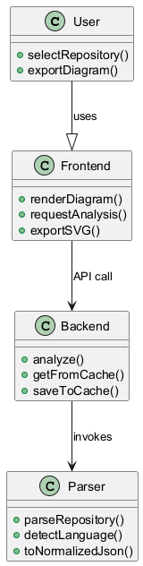

# UML Designer AI

> **A powerful, user-friendly platform for generating, analyzing, and visualizing UML diagrams from code or natural language prompts.**

[](LICENSE)

## 🎥 Demo Video

<p align="center">
  <a href="Demo.mp4">
    
  </a>
  <br>
  <i>⬆️ Click to download and watch the demo video (Demo.mp4)</i>
</p>


## What is UML Designer AI?

**UML Designer AI** is an open-source tool that helps you turn your ideas, code, or requirements into clear, professional UML diagrams—instantly. Whether you’re a developer, student, project manager, or business analyst, you can:

- **Paste code** (Python, Java, C#, C++, and more) and get a visual diagram of its structure.
- **Describe your system in plain English** and see it visualized as a UML diagram.
- **Collaborate**: Share diagrams with your team, export images, or embed them in docs.

**Why UML?**

Unified Modeling Language (UML) is the global standard for visualizing software architecture, processes, and relationships. It bridges the gap between technical and non-technical stakeholders.

---

---


## ✨ Key Features

- **Prompt-to-UML**: Instantly generate diagrams from code or natural language.
- **Multi-language Support**: Works with Python, Java, C#, C++, and more.
- **Modern Web UI**: Clean, intuitive interface—no technical skills required.
- **RESTful API**: Integrate with other tools or automate diagram generation.
- **Customizable & Extensible**: Modular backend and parser for advanced users.
- **Cloud-Ready**: Easy deployment to cloud platforms or your own server.
- **Collaboration**: Export, share, and embed diagrams anywhere.
- **Testing Suite**: Robust tests for reliability and quality.

---

---


## 🚀 Getting Started


### Prerequisites

- **Node.js** (v18+ recommended)
- **Python** (3.9+ recommended)
- **npm** (v9+)
- (Optional) **Docker** for containerized deployment


### 1. Clone the Repository

```sh
git clone https://github.com/<your-org>/uml.git
cd uml
```

### 2. Install Backend (API Server)

```sh
cd backend
npm install
```

### 3. Install Frontend (Web App)

```sh
cd ../frontend
npm install
```

### 4. Set Up Python Parser (Code Analyzer)

```sh
cd ../python-parser
pip install -r requirements.txt
```

---


## 🖥️ Usage

### Start All Services (Development)

Open three terminals and run each service:

```sh
# 1. Backend (Node.js)
cd backend
npm run dev

# 2. Frontend (Next.js)
cd ../frontend
npm run dev

# 3. Python Parser (Flask)
cd ../python-parser
python app.py
```

### Example: Generate a UML Diagram

1. Open your browser to [http://localhost:3000](http://localhost:3000)
2. Paste code or type a description (e.g., "A system with a User, Account, and Transaction")
3. Choose your diagram type (Class, Sequence, etc.)
4. Click **Generate** and see your diagram appear!


<p align="center">
  
</p>

---

---


## ⚙️ Configuration

- **Backend**: Set environment variables in `backend/.env` (see `backend/README.md` for details)
- **Frontend**: Edit `frontend/utils/config.js` or use environment variables
- **Python Parser**: See `python-parser/README.md` for advanced options

---


## 🛠️ API Endpoints & Core Components

### Backend (Node.js/Express)

- `POST /api/analyze` — Analyze code and return diagram data
- `POST /api/generate-plantuml` — Generate PlantUML from code/prompt
- `GET /api/health` — Health check endpoint

See `backend/routes/api.js` for full details.

### Python Parser (Flask)

- `POST /analyze` — Analyze a GitHub repo or ZIP upload and return schema/metadata
- `POST /generate-plantuml` — Generate PlantUML from analysis schema
- `POST /uml-from-prompt` — Generate UML from a natural language prompt
- `GET /health` — Health check endpoint

See `python-parser/app.py` for all endpoints and request/response formats.

**How it works:**


---

uml/

## 🗂️ Folder / Architecture Overview

<details>
<summary><strong>Click to expand project structure</strong></summary>

```text
uml/
├── backend/         # Node.js REST API server
│   ├── routes/      # API route handlers
│   ├── scripts/     # Deployment and utility scripts
│   ├── utils/       # Core backend utilities
│   └── __tests__/   # Backend test suite
├── frontend/        # Next.js web application
│   ├── components/  # React components
│   ├── pages/       # Next.js pages
│   ├── utils/       # Frontend utilities
│   └── __tests__/   # Frontend test suite
├── python-parser/   # Flask server and code analysis engine
│   ├── analyzers/   # Language analyzers
│   ├── plantuml/    # PlantUML generation logic
│   ├── utils/       # Utility modules (error handling, security, etc.)
│   ├── __tests__/   # Python parser tests
│   └── requirements.txt
├── diagrams/        # Example output diagrams
├── logs/            # Log files
└── ...              # Project configs, docs, and scripts
```
</details>

---

## Visual Overview

UML Designer AI provides a complete visual map of your system, from user actions to backend architecture. Here's how your codebase is represented:

### 1. Class Structure
Shows the main classes and their relationships.

<p align="center">
	
	<br><i>Class Diagram: Core system classes and their connections</i>
</p>

### 2. Use Case Flow
Illustrates how users interact with the system.

<p align="center">
	
	<br><i>Use Case Diagram: User actions and system features</i>
</p>

### 3. Activity & State
Shows the workflow and system states during analysis and diagram generation.

<div align="center" style="display:flex; gap:32px; flex-wrap:wrap; justify-content:center;">
	<div>
		
		<br><i>Activity Diagram: End-to-end workflow</i>
	</div>
	<div>
		
		<br><i>State Diagram: System states</i>
	</div>
</div>

### 4. Sequence & Communication
Depicts how components interact to process requests.

<div align="center" style="display:flex; gap:32px; flex-wrap:wrap; justify-content:center;">
	<div>
		
		<br><i>Sequence Diagram: Request flow</i>
	</div>
	<div>
		
		<br><i>Communication Diagram: Component messaging</i>
	</div>
</div>


### 5. Component Overview
Shows the major modules and their connections.

<p align="center">
	
	<br><i>Component Diagram: Major modules</i>
</p>

---

---


## 🤝 Contributing Guidelines

We welcome contributions from everyone—developers, designers, writers, and testers! To get started:

1. **Fork** the repo and create your branch
2. **Write clear, well-tested code** and update/add documentation
3. **Open a pull request** with a detailed description of your changes

See [CONTRIBUTING.md](CONTRIBUTING.md) for more details.

---


## 📝 License

This project is licensed under the [MIT License](LICENSE).

---


## 🙏 Credits

- Inspired by the open-source UML and diagramming community
- Built with [Node.js](https://nodejs.org/), [Next.js](https://nextjs.org/), [Flask](https://flask.palletsprojects.com/), and [PlantUML](https://plantuml.com/)
- Special thanks to all contributors and testers

---


---

> _For questions, issues, or feature requests, please open an issue on GitHub._
